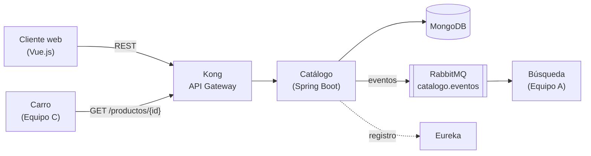

# 🛍️ Tienda Virtual — Microservicio de Catálogo


**Equipo B** · Ingeniería de Software II · Universidad Industrial de Santander (UIS)

Catálogo es la **fuente de verdad de los productos** de la tienda virtual. Expone un CRUD de productos por REST (a través de Kong) y publica eventos en RabbitMQ para que los demás servicios se mantengan sincronizados.

## Arquitectura



El detalle de las capas internas está en [ARQUITECTURA-CATALOGO.md](docs/ARQUITECTURA-CATALOGO.md).

## Documentación

| Documento | Contenido |
|---|---|
| [Contrato de servicio](docs/CONTRATO-CATALOGO.md) | Endpoints, modelos, errores y eventos acordados con los equipos A y C (v2.2) |
| [Historias de usuario](docs/HISTORIAS.md) | Backlog con criterios de aceptación |
| [Arquitectura](docs/ARQUITECTURA-CATALOGO.md) | Stack, capas internas y decisiones de diseño |

## Estructura del repositorio

```
├── docs/      Documentación del proyecto
└── backend/   Microservicio de Catálogo (Spring Boot)
```

## Cómo ejecutar el backend

**Requisitos:** JDK 21. No hace falta instalar Maven: el proyecto trae el Maven Wrapper (`mvnw`).

```bash
cd backend
./mvnw test              # corre las pruebas
./mvnw spring-boot:run   # arranca el servicio en http://localhost:8080
```

En Windows usa `mvnw.cmd` en lugar de `./mvnw`.

> Esta sección se irá actualizando a medida que se integren MongoDB, RabbitMQ, Eureka y Kong con Docker.
>
> ¿Eres del equipo y vas a empezar? Sigue la [guía de inicio](GUIA-INICIO.md).

## Estado — Segunda entrega

- [x] Documentación: historias, arquitectura y contrato
- [x] Esqueleto del backend
- [ ] Conexión a MongoDB con Docker
- [ ] Historia 1 — Registrar producto
- [ ] Historia 2 — Listar productos
- [ ] Historia 3 — Ver detalle de un producto
- [ ] Historia 4 — Actualizar producto
- [ ] Historia 5 — Desactivar producto
- [ ] Historia 6 — Listar categorías
- [ ] Publicación de eventos en RabbitMQ
- [ ] Registro en Eureka
- [ ] Integración con Kong

## Equipo B

| Integrante | Parte |
|---|---|
| _Rances Ramirez_ | Backend |
| _Nombre_ | Backend |
| _Nombre_ | Backend |
| _Nombre_ | Backend |
| _Nombre_ | Frontend |
| _Nombre_ | Frontend |
| _Nombre_ | Frontend |
