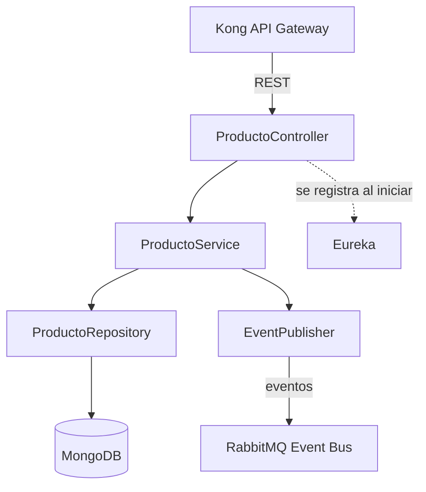

# Arquitectura — Catálogo (Equipo B)

**Entrega:** Primera entrega — Ciclo 1 (actualizado en Ciclo 2)
**Versión:** 1.1
**Fecha:** 2026-09-10

## 1. Rol en el sistema

Catálogo es uno de los 5 microservicios del sistema (junto a Búsqueda, Carro, Descuento y Órdenes), y es la **fuente de verdad de los productos**. Todo el tráfico externo pasa por Kong (API Gateway); Catálogo se registra en Eureka para ser descubierto, y publica eventos a RabbitMQ para que Búsqueda mantenga su índice sin consultarlo directamente. El diagrama general del sistema (ya entregado por el equipo) muestra este contexto completo; este documento se enfoca solo en la pieza de Catálogo.

## 2. Stack tecnológico

| Tecnología | Uso en Catálogo |
|---|---|
| Spring Boot 4.1.1 (Java 21) | Framework del microservicio |
| MongoDB 7.0 | Persistencia de productos y categorías (documento, no relacional) |
| Spring Data MongoDB | Capa de acceso a datos |
| Eureka Client | Registro y descubrimiento del servicio |
| Docker (Docker Compose) | Empaquetado y entorno reproducible; en desarrollo, MongoDB corre en un contenedor definido en `backend/docker-compose.yml` |
| RabbitMQ (vía Spring AMQP) | Publicación de eventos de dominio |

## 3. Arquitectura interna

Capas: **Controller** expone los endpoints REST y valida entrada; **Service** contiene la lógica de negocio (validaciones, reglas de soft delete); **Repository** es la interfaz de Spring Data hacia MongoDB; **EventPublisher** emite los eventos de dominio después de cada operación de escritura exitosa.

> Nota: este diagrama se renderiza automáticamente al ver el archivo en GitHub (soporta Mermaid de forma nativa en Markdown).

## 4. Modelo de datos

Producto y Categoría, con sus campos y reglas de validación, están definidos en detalle en `CONTRATO-CATALOGO.md`. En resumen: Producto es el documento principal (nombre, precio, categoría, stock, imágenes, activo); Categoría es una lista precargada y de solo lectura en esta fase.

## 5. Decisiones de diseño

- **MongoDB en vez de relacional:** los productos no siempre comparten los mismos atributos, y el modelo de documento evita forzar una estructura rígida.
- **Soft delete (`activo:false`) en vez de borrado físico:** preserva integridad si otro servicio (como Órdenes, más adelante) referencia un producto históricamente.
- **El precio y el stock los valida y devuelve siempre Catálogo, nunca el cliente:** evita que Carro u otro servicio confíen en datos que el usuario podría manipular.
- **Eventos hacia Búsqueda, llamada síncrona para Carro:** Búsqueda no necesita el dato al instante y vive bien con un índice eventualmente consistente; Carro sí necesita confirmar en el momento antes de dejar continuar al usuario.
- **Errores con código, no solo texto:** permite que cualquier consumidor reaccione programáticamente sin parsear mensajes.
- **MongoDB 7.0 y no 8.x, con versión fijada:** MongoDB 8 no arranca con los kernels Linux 6.19 a 7.0.13. Un cambio del kernel afectó su administrador de memoria, y MongoDB decidió bloquear el arranque para evitar caídas y posible corrupción de datos. Docker Desktop en macOS usa hoy una máquina virtual con kernel 7.0.12, así que la 8 no arranca en el equipo de uno de los integrantes. Según la matriz de compatibilidad oficial de MongoDB (ticket SERVER-125742), la 7.0 funciona con cualquier kernel. Fijar `mongo:7.0` en `docker-compose.yml`, en vez de usar `latest`, garantiza que todo el equipo use la misma versión en Mac y en Windows. Para Catálogo no hay diferencia funcional; se puede volver a la 8 cuando Docker Desktop traiga un kernel 7.0.14 o superior.

## 6. Documentos relacionados

- `CONTRATO-CATALOGO.md` — contrato completo de endpoints, modelos y eventos (entregable de Segunda entrega, Ciclo 2)
- `HISTORIAS.md` — backlog de historias de usuario de Catálogo

## 7. Historial de cambios

| Fecha | Cambio |
|---|---|
| 2026-08-21 | v1.0 — versión inicial (Primera entrega) |
| 2026-09-10 | v1.1 — Se fijan las versiones del stack (Spring Boot 4.1.1 con Java 21, MongoDB 7.0) y se documenta por qué MongoDB 7.0 y no 8.x |
